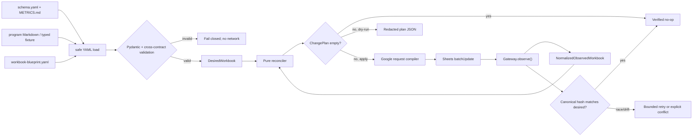

# Phase 1: Standalone Workbook and Four Programs — Research

**Researched:** 2026-07-25  
**Revised:** 2026-07-30
**Domain:** Google Sheets workbook provisioning, declarative reconciliation, workout-program bootstrap  
**Confidence:** HIGH для repository contracts; MEDIUM для Google API integration details і package versions

<user_constraints>
## User Constraints (from CONTEXT.md)

### Locked Decisions

### Mobile UX і навігація
- `Старт` показує наступний комплекс, останню завершену сесію, чотири швидкі
  посилання та redacted status sync/backup.
- Один tap із `Старт` відкриває `Програма` з відповідним filter view.
- Основні дії не потребують горизонтального scroll на вузькому mobile viewport.
- Ручний режим залишається повністю придатним без ChatGPT integration.

### Visual system і dashboard
- Використовується світла high-contrast тема з послідовним accent color для
  кожного workout type.
- Значення не кодуються лише кольором: status завжди має текст або symbol.
- `Дашборд` починається з компактних summary cards, нижче містить filters,
  contract-defined trends і data-quality statuses.
- Headers frozen, input/system zones візуально розділені; декоративні merged
  cells та надмірне форматування не використовуються.

### Manual input і validation
- `Сесії` та `Підходи` мають append-only managed input zones; user-editable
  columns ідуть першими, system/formula columns захищені.
- Сесія створюється перед дочірніми sets; зв’язок завжди використовує
  `session_id`, а не row number.
- Stable IDs генеруються один раз керованою операцією й не змінюються після
  сортування або factual correction.
- Missing дозволене значення лишається blank/`NULL`; critical omission отримує
  visible validation status і не перетворюється на zero.
- Dates/times використовують timezone і locale, явно задані workbook
  properties.
- Початковий workbook використовує locale `uk_UA` і timezone
  `America/New_York`; зміна цих properties є explicit configuration change,
  а не runtime inference.

### Setup, formulas і portability
- Workbook описується version-controlled machine-readable blueprint і
  застосовується повторюваним Python setup command із dry-run/test backend.
- Setup створює або reconciles лише managed tabs, ranges, formulas, validation,
  protections і charts; він не видаляє довільні user objects.
- Формули мають pinned `formula_version`, реалізують лише `METRICS.md` і
  перевіряються тими самими canonical fixtures, що й локальна metric semantics.
- Program bootstrap бере чотири комплекси з repository specifications,
  детерміновано створює початкові IDs і не змінює вже використану version.
- Lower Hypertrophy C1 у початковій version є exact
  `Dumbbell Romanian deadlift`; перехід на barbell variant потребує нової
  program version і окремого comparison cohort.
- Clean-workbook та second-run idempotency UAT виконуються на test Spreadsheet;
  production locator і credentials лишаються поза Git.

### the agent's Discretion
- Конкретні Python libraries, module boundaries і workbook blueprint format
  обираються за project constraints та uv-style tooling.
- Точні accent colors, column widths і chart geometry можуть бути підібрані під
  accessibility та mobile UAT без зміни domain semantics.
- Схвалений базовий dependency set: Pydantic, PyYAML,
  `google-api-python-client`, `google-auth` і pytest через uv із committed
  lockfile; executor перевіряє package source та pinned resolution перед
  використанням.
- Package-legitimacy checkpoint для цього базового set схвалено користувачем
  відповіддю «на всі запитання — 1»; executor не повинен повторно блокувати
  offline setup, якщо canonical package names/sources не змінилися.
- Live test-Spreadsheet UAT використовує local installed-app OAuth із
  мінімальним Sheets scope, untracked token storage та disposable test target;
  service account і production target не є default Phase 1 path.

### Deferred Ideas (OUT OF SCOPE)
- ChatGPT preview/confirm/write tools — Phase 2.
- Coherent snapshots, SQLite mirror і query tools — Phase 3.
- Evidence-backed recommendations і program decision workflow — Phase 4.
</user_constraints>

<phase_requirements>
## Phase Requirements

| ID | Description | Research Support |
|---|---|---|
| REQ-WBK-01 | Workbook має рівно сім вкладок: `Старт`, `Програма`, `Сесії`, `Підходи`, `Рекомендації`, `Довідники`, `Дашборд`. | Declarative topology, clean-workbook acceptance і non-destructive drift policy. [VERIFIED: codebase — `.planning/REQUIREMENTS.md`, `docs/specs/SPEC-GOOGLE-SHEETS-WORKBOOK.md`] |
| REQ-WBK-02 | `Програма` містить чотири версійовані комплекси без втрати paired-set, reps, RIR, rest і equipment semantics. | Typed bootstrap fixture, deterministic IDs, definition hashes і explicit ambiguity gate. [VERIFIED: codebase — `4-day upper lower program/`, `config/schema.yaml`] |
| REQ-WBK-03 | Input fields мають validation, hints, formats і mobile-friendly порядок, а formula/system columns захищені. | Blueprint-driven field roles, validation ranges, notes, widths, freeze і protection reconciliation. [VERIFIED: codebase — `01-CONTEXT.md`, workbook spec] |
| REQ-WBK-04 | Formulas і dashboard показують лише визначені metric contracts та explicit missing/incomparable status. | Shared canonical fixtures, formula registry `metrics-v1`, status-first outputs і live recalculation UAT. [VERIFIED: codebase — `docs/architecture/METRICS.md`] |
| REQ-WBK-05 | Повторний setup не дублює managed objects або logical content. | Observe → normalize → diff → plan → apply → re-observe architecture; second-run empty-plan test. [VERIFIED: codebase — `01-CONTEXT.md`, workbook spec] |
</phase_requirements>

## Project Constraints (from AGENTS.md)

- Google Spreadsheet є primary standalone product; Google Sheets володіє operational facts і versioned prescriptions, Git володіє schemas, formulas, rules, tests та docs. [VERIFIED: codebase — `AGENTS.md`]
- Runtime: Python 3.12+, uv-style dependencies, Pydantic validation boundary; authoritative numeric semantics використовують `Decimal` або scaled integers. [VERIFIED: codebase — `AGENTS.md`]
- Row number ніколи не є identity; обов’язкові source-owned immutable `program_item_id`, `session_id`, `set_id`, `recommendation_id`; unknown зберігається як `NULL`. [VERIFIED: codebase — `AGENTS.md`, `config/schema.yaml`]
- Raw source facts, `sheet_calculated` та `local_derived` значення не змішуються; формульні cache values не є analytical evidence. [VERIFIED: codebase — `AGENTS.md`, `config/schema.yaml`, `METRICS.md`]
- Setup не має повторювати live locator, credentials, personal rows, health context або notes у Git, fixtures чи logs. [VERIFIED: codebase — `AGENTS.md`]
- Human-facing prose та точні Sheet labels — українською; identifiers/schema keys/requirement IDs/technology names — англійською. [VERIFIED: codebase — `AGENTS.md`]
- Зміна source column, formula або rule потребує відповідного version bump і синхронних tests/docs. [VERIFIED: codebase — `AGENTS.md`]
- Для documentation-only verification слід parse all YAML, виконати `git diff --check`, перевірити relative Markdown links, privacy/secret scan і requirement-to-phase coverage. [VERIFIED: codebase — `AGENTS.md`]

## Summary

Фазу слід планувати як один pure domain pipeline з тонким Google adapter, а не як набір імперативних API-викликів. Version-controlled YAML blueprint описує desired logical workbook; Pydantic fail-closed валідатор поєднує його з authoritative `config/schema.yaml` і typed program fixture; pure reconciler порівнює desired state з normalized observed state та повертає ordered `ChangePlan`. Dry-run і in-memory backend виконують той самий plan, що й live Google adapter. [VERIFIED: codebase — `01-CONTEXT.md`, workbook spec] [CITED: https://docs.pydantic.dev/latest/api/config/]

Google adapter має спочатку читати вузький structural projection через `spreadsheets.get`, потім застосовувати explicit, field-masked requests через `spreadsheets.batchUpdate`, після чого повторно читати й canonicalize state. Один `batchUpdate` повністю валідовується до mutation і застосовує request list атомарно, але collaborator edits можуть змінити результат одразу після відповіді; тому потрібні pre/post fingerprints і bounded retry, а не припущення про транзакційний lock. [CITED: https://developers.google.com/workspace/sheets/api/reference/rest/v4/spreadsheets/get] [CITED: https://developers.google.com/workspace/sheets/api/reference/rest/v4/spreadsheets/batchUpdate]

Колишні decision gaps закриті в оновленому `01-CONTEXT.md`: Lower Hypertrophy C1 має exact variant `Dumbbell Romanian deadlift`; початкові workbook properties — locale `uk_UA` і timezone `America/New_York`; live UAT default — local installed-app OAuth із minimum Sheets scope, untracked token storage і disposable test target. Barbell RDL надалі означає нову program version та окремий comparison cohort. [VERIFIED: codebase — updated `01-CONTEXT.md`]

**Primary recommendation:** реалізувати `Blueprint → validate → observe → reconcile → dry-run/apply → verify` з immutable typed models, canonical logical hashes і двома backends (`InMemoryWorkbookGateway`, `GoogleSheetsGateway`); live test-workbook UAT виконувати через approved installed-app OAuth path лише після explicit credential/locator preflight. [VERIFIED: codebase — locked context]

## Architectural Responsibility Map

| Capability | Primary Tier | Secondary Tier | Rationale |
|---|---|---|---|
| Workbook blueprint і program bootstrap | Git / local application | Google Sheets | Git owns contracts; Sheet receives operational projection. [VERIFIED: codebase — `AGENTS.md`] |
| Schema/blueprint validation | Local Python boundary | — | Invalid contract must fail before network mutation. [VERIFIED: codebase — Pydantic accepted decision] |
| Reconciliation і dry-run | Local application | Google adapter | Diff is pure; adapter translates already-approved changes to API requests. [VERIFIED: codebase — `01-CONTEXT.md`] |
| Daily manual capture UX | Google Sheets client | Local setup | The Spreadsheet is the standalone product; setup only provisions it. [VERIFIED: codebase — `AGENTS.md`] |
| Formula display/dashboard | Google Sheets | Local fixture oracle | Sheet displays derived cache; canonical fixtures verify semantics. [VERIFIED: codebase — `METRICS.md`] |
| Credential handling/UAT | Local runtime + Google auth | Test Spreadsheet | Locator/credentials remain outside Git and target is allowlisted. [VERIFIED: codebase — `AGENTS.md`] |

## Standard Stack

### Core

| Library/tool | Verified current version | Purpose | Decision |
|---|---:|---|---|
| Python | `>=3.12` (host has `3.14.4`) | Runtime, `Decimal`, UUID/hash/canonical JSON | Locked. [VERIFIED: codebase + environment probe] |
| `uv` | install current official release; unavailable on host | Project/lock/environment management | Use `pyproject.toml`, `uv.lock`, `requires-python = ">=3.12"`, dependency groups. [CITED: https://docs.astral.sh/uv/concepts/projects/dependencies/] |
| `pydantic` | `2.13.4`, published 2026-05-06 | Strict immutable blueprint and fixture models | Use `ConfigDict(extra="forbid", frozen=True)` and explicit validators. [CITED: https://docs.pydantic.dev/latest/api/config/] |
| `PyYAML` | `6.0.3`, published 2025-09-25 | Parse existing YAML contracts and new blueprint | Use only `yaml.safe_load`; never `yaml.load`. [CITED: https://pyyaml.org/wiki/PyYAMLDocumentation] |
| `google-api-python-client` | `2.198.0`, published 2026-06-25 | Official Sheets v4 discovery client | Keep transport types inside adapter. [CITED: https://developers.google.com/workspace/sheets/api/quickstart/python] |
| `google-auth` | `2.56.2`, published 2026-07-21 | Runtime credentials for test-workbook apply | Load credentials through documented Google mechanisms, never CLI args. [CITED: https://google-auth.readthedocs.io/en/latest/] |

### Supporting

| Library | Verified current version | Purpose | When to use |
|---|---:|---|---|
| `pytest` | `9.1.1`, published 2026-06-19 | Unit, contract, golden-plan and opt-in UAT tests | Development dependency group. [CITED: https://docs.pytest.org/en/stable/how-to/parametrize.html] |
| Python stdlib (`hashlib`, `json`, `uuid`, `decimal`, `dataclasses`/`typing`) | Python 3.12+ | Canonical hashes, deterministic source IDs, exact arithmetic, ports | Prefer stdlib; no package needed. [VERIFIED: codebase constraint] |

### Alternatives Considered

| Instead of | Could Use | Tradeoff |
|---|---|---|
| Official discovery client | High-level Sheets wrapper | Wrapper may simplify value I/O, but this phase needs complete structural request/response objects, IDs and field masks; use the official client. [CITED: https://developers.google.com/workspace/sheets/api/reference/rest/v4/spreadsheets/request] |
| YAML blueprint | JSON | JSON reduces parser dependency, but repository contracts are already YAML and human review is central; use safe-loaded YAML plus strict Pydantic. [VERIFIED: codebase — `config/*.yaml`] |
| Pure fake gateway | HTTP mocks | HTTP mocks overfit discovery-client internals; fake the project-owned port and separately contract-test request compilation. [RECOMMENDATION: architecture reasoning] |

**Installation (after uv installation and executor re-check of canonical package names/sources):**

```bash
uv add "pydantic>=2.13,<3" "PyYAML>=6.0,<7" \
  "google-api-python-client>=2.198,<3" "google-auth>=2.56,<3"
uv add --dev "pytest>=9.1,<10"
```

Registry versions and publish dates were checked through PyPI JSON because `pip`/`uv` are absent on the host. [VERIFIED: PyPI registry probe]

## Package Legitimacy Audit

The required legitimacy seam found all packages on PyPI with established source repositories, but returned `SUS` because download telemetry was unavailable; the two Google packages were additionally flagged `too-new` for their latest release. The user explicitly resolved the grouped checkpoint with blanket choice 1 for this canonical set through uv. Executor proceeds without another human block only while package names and documented sources remain unchanged, and must still verify canonical source plus pinned resolution before use. [VERIFIED: package-legitimacy seam + updated `01-CONTEXT.md`]

| Package | Registry | Age | Downloads | Source Repo | Verdict | Disposition |
|---|---|---:|---|---|---|---|
| `pydantic` | PyPI | since 2017 | unavailable | `github.com/pydantic/pydantic` | SUS | Approved by user for canonical source; executor re-checks source/pin |
| `PyYAML` | PyPI | since 2011 | unavailable | `pyyaml.org` | SUS | Approved by user for canonical source; executor re-checks source/pin |
| `google-api-python-client` | PyPI | since 2011 | unavailable | `github.com/googleapis/google-api-python-client` | SUS | Approved by user for canonical source; executor re-checks source/pin |
| `google-auth` | PyPI | since 2016 | unavailable | `github.com/googleapis/google-cloud-python/tree/main/packages/google-auth` | SUS | Migrated upstream mapping separately approved by user on 2026-07-30; executor re-checks source/pin |
| `pytest` | PyPI | since 2010 | unavailable | `github.com/pytest-dev/pytest` | SUS | Approved by user for canonical source; executor re-checks source/pin |

**Packages removed due to SLOP verdict:** none.  
**Packages flagged as suspicious [SUS]:** all five retain their seam verdict for traceability, but the grouped human checkpoint is **RESOLVED** by explicit user approval. The later `google-auth` migration from the archived `google-auth-library-python` repository to `google-cloud-python/tree/main/packages/google-auth` was re-opened by the executor and separately approved by the user on 2026-07-30. Re-open the checkpoint only if a package name or canonical source changes again; ordinary version resolution remains executor-verified and locked in `uv.lock`. [VERIFIED: updated `01-CONTEXT.md`]

## Architecture Patterns

### System Architecture Diagram



### Recommended Project Structure

```text
pyproject.toml
uv.lock
config/
├── schema.yaml
├── progression-rules.yaml
├── workbook-blueprint.yaml
└── program-bootstrap.yaml
src/workout_tracker/
├── cli.py
├── contracts/
│   ├── blueprint.py
│   ├── source_schema.py
│   └── program.py
├── workbook/
│   ├── model.py
│   ├── canonical.py
│   ├── reconcile.py
│   ├── formulas.py
│   └── requests.py
└── adapters/
    ├── port.py
    ├── memory.py
    └── google_sheets.py
tests/
├── fixtures/
│   ├── metrics-v1.yaml
│   ├── program-v1.yaml
│   └── observed-workbooks/
├── unit/
├── contract/
└── uat/
```

The machine-readable `program-bootstrap.yaml` is a validated transcription/fixture of the five repository program files, not a new authority; tests must prove each row’s source locator and definition hash. [VERIFIED: codebase authority boundary]

### Pattern 1: Typed desired state, not imperative script

`WorkbookBlueprint` should contain `workbook_contract_version`, exact tab order/titles, columns and roles, validations, named ranges, protections, conditional rules, filter views, formulas with `formula_version`, charts and bootstrap version. Models reject extras and are immutable after validation. [VERIFIED: codebase — workbook spec] [CITED: https://docs.pydantic.dev/latest/api/config/]

```python
from pydantic import BaseModel, ConfigDict

class StrictModel(BaseModel):
    model_config = ConfigDict(extra="forbid", frozen=True)

class WorkbookBlueprint(StrictModel):
    workbook_contract_version: str
    schema_version: str
    formula_version: str
    program_bootstrap_version: str
    tabs: tuple["TabBlueprint", ...]
```

### Pattern 2: Pure reconciliation with stable logical keys

Every managed object has a project-owned logical key such as `tab:sessions`, `named_range:lookup_workout_types`, `protection:sessions_system_columns`, `chart:dashboard_volume_trend`. Observed API IDs are attributes resolved during observe/apply, never the logical identity. Reconciler returns `Add`, `Update`, `NoOp` and narrowly-scoped `RemoveManaged` operations; it never removes unowned objects. [VERIFIED: codebase — workbook spec] [CITED: https://developers.google.com/workspace/sheets/api/samples/ranges]

Owner markers should use stable developer metadata where supported and a namespaced description/title fallback where an object cannot carry metadata. Developer metadata can associate arbitrary keys with spreadsheet/sheet/row/column locations and be searched through `DataFilter`. [CITED: https://developers.google.com/workspace/sheets/api/guides/metadata]

### Pattern 3: Deterministic initial source IDs

Generate bootstrap IDs once from a pinned namespace plus a semantic logical key (`program_bootstrap_version`, workout alias, block code, exercise order), force RFC variant/version bits to satisfy the schema’s UUID4-shaped regex, prefix with `prg_`/`pver_`, and persist the resulting source-owned values in the fixture and Sheet. Do not derive IDs from mutable exercise text or row number. If the same logical key has a different `definition_sha256`, fail closed and require a new program version. [VERIFIED: codebase — `id_policy`, workbook spec]

### Pattern 4: Safe ordered apply

Compile dependency-ordered waves: spreadsheet locale/timezone and missing tabs; headers/program rows/lookups; named ranges; validations/formats/formulas; protections/filter views/conditional rules; dashboard charts; post-read verification. Within each wave, use one bounded `batchUpdate` where dependencies allow. Explicit field masks preserve user-owned fields; wildcard masks are unsafe for production updates. [CITED: https://developers.google.com/workspace/sheets/api/guides/field-masks] [CITED: https://developers.google.com/workspace/sheets/api/reference/rest/v4/spreadsheets/batchUpdate]

### Anti-Patterns to Avoid

- **Create-on-every-run:** add requests without observation duplicate named ranges, protections, rules, views and charts. Reconcile by logical key and API ID. [CITED: https://developers.google.com/workspace/sheets/api/reference/rest/v4/spreadsheets/request]
- **Full-resource equality:** effective/default formatting and API-generated IDs are noisy. Compare a canonical allowlist of managed fields only. [RECOMMENDATION: reconciliation design]
- **Wildcard field masks:** future/read-only fields can cause errors or unintended clearing; list fields explicitly. [CITED: https://developers.google.com/workspace/sheets/api/guides/field-masks]
- **Delete and recreate to update:** object IDs and user references become unstable. Prefer update requests; remove only owner-marked obsolete objects. [VERIFIED: codebase non-destructive setup]
- **Row-number formulas/identity:** sorting breaks linkage. Use source-owned IDs and header-resolved formula templates/named ranges. [VERIFIED: codebase — `AGENTS.md`]
- **Formula-only validation:** protection is UX, not a security or integrity boundary; Pydantic/local validation remains mandatory. [VERIFIED: codebase — workbook spec]
- **`USER_ENTERED` for untrusted text:** Sheets parses formula-like strings; source text values must use typed `userEnteredValue.stringValue` or `RAW`, while formulas are written only from Git-owned templates. [CITED: https://developers.google.com/workspace/sheets/api/guides/values]

## Program Bootstrap and Workbook Blueprint

The program fixture should contain 31 prescription rows: 8 upper-strength, 7 lower-strength, 8 upper-hypertrophy and 8 lower-hypertrophy entries. Each row needs source file/section, workout type, block/pair code, order, exact exercise family/variant/equipment/setup/cohort, sets, modality, laterality, reps/duration, RIR, rest range, optionality, priority, technical notes and definition hash. [VERIFIED: codebase — four program day files; count by table rows]

Paired-set semantics belong in `block_code` plus `exercise_order`; unequal pair counts (for example, fourth bench set without curl) remain `target_sets` per item rather than duplicated fake rows. Unilateral prescriptions use `laterality` and per-side semantics; side plank uses duration fields, not fake repetitions. [VERIFIED: codebase — program files, `config/schema.yaml`]

Do not parse free-form Markdown at every setup run. Implement one audited importer/transcription step that produces `config/program-bootstrap.yaml`, then validate that fixture against canonical source-locator snapshots and hashes. This makes execution deterministic while preserving Markdown as bootstrap specification. [VERIFIED: codebase authority boundary]

Blueprint validation must assert exactly seven desired managed tabs in exact order, exactly four Ukrainian workout labels, all schema headers once, one active program version, unique IDs/logical keys, valid foreign references, complete formula versions and chart/named-range references. [VERIFIED: codebase — requirements, schema, workbook spec]

On a clean test Spreadsheet, setup may delete/rename the initial default blank sheet only as part of explicit initialization and must finish with exactly seven tabs. On a non-clean workbook, an unowned extra tab conflicts with “exactly seven” but may not be silently deleted; report `UNMANAGED_TAB_PRESENT` and require explicit owner cleanup. [VERIFIED: codebase — REQ-WBK-01 plus locked non-destructive setup]

## Formula, Validation, Protection and Chart Setup

### Formula strategy

- Store formula templates in a registry keyed by stable `formula_id` and `formula_version="metrics-v1"`; never embed ad-hoc formulas inside API adapter code. [VERIFIED: codebase — `METRICS.md`]
- Every numeric metric has a neighboring explicit status/reason output. Missing, invalid, not applicable or incomparable inputs yield blank metric cells plus status, never synthetic zero. [VERIFIED: codebase — `METRICS.md`]
- Working-set eligibility requires completed session/set, current valid revision, role `working` or `backoff`, and complete required components; warm-ups/skipped/void records do not contribute. [VERIFIED: codebase — `METRICS.md`]
- e1RM is Epley `load_kg * (30 + reps) / 30`, reps 1–12, mass-only eligible load, complete cohort; RIR is not added to reps. [VERIFIED: codebase — `METRICS.md`]
- Charts read precomputed helper ranges filtered to one cohort/unit family. Set `headerCount` explicitly and keep `interpolateNulls=false` so missing values remain visible gaps. [CITED: https://developers.google.com/workspace/sheets/api/reference/rest/v4/spreadsheets/charts]

### Canonical formula fixtures

Use YAML cases with typed source rows and expected `{value, unit, status, exclusion_reasons}`. Required cases: valid kg, exact lb conversion, missing load, incomplete unilateral components, warm-up, skipped/void, mixed cohort, machine level, assistance/bodyweight, e1RM reps 1/12/13, Decimal `.05` tie, paired-set rest, and missing RIR. The pure Python fixture oracle and live Sheet assertions consume the same cases. [VERIFIED: codebase — `METRICS.md` required tests]

Unit tests verify formula template text and range references; the in-memory backend verifies placement/version/idempotency; only live test-workbook UAT verifies Google’s formula evaluation. Fake backends must not pretend to emulate the Sheets formula engine. [RECOMMENDATION: test boundary]

### Validation and formatting

Use `SetDataValidationRequest` over bounded managed input ranges. Finite enums reference hidden/visually separated `Довідники` named ranges; numeric/date/custom cross-field rules use the matching condition type, strict rejection where safe, and Ukrainian help text. `filteredRowsIncluded=true` prevents gaps when a filter view hides rows. [CITED: https://developers.google.com/workspace/sheets/api/reference/rest/v4/spreadsheets/request]

Number/date rendering depends on spreadsheet locale, while timezone is an explicit spreadsheet property. Set and verify both before writing formulas/fixtures. [CITED: https://developers.google.com/workspace/sheets/api/guides/formats] [CITED: https://developers.google.com/workspace/sheets/api/reference/rest/v4/spreadsheets]

Conditional formatting should use boolean/custom-formula rules for missing required values, invalid bundle, duplicate ID and pending recommendation. It can safely set only supported text/background emphasis; alignment/borders in conditional rules cause invalid requests. Always pair color with a text/symbol status. [CITED: https://developers.google.com/workspace/sheets/api/guides/conditional-format]

### Protections and charts

Protect system/formula ranges with real protected ranges, not warning-only ranges; expose IDs for audit but visually separate or hide them. `warningOnly=true` still lets everyone edit after a prompt and ignores editors, so it does not satisfy protected system columns. Protection remains an UX guard, not the validation boundary. [CITED: https://developers.google.com/workspace/sheets/api/reference/rest/v4/spreadsheets/sheets] [VERIFIED: codebase — workbook spec]

Charts are managed by logical key + observed `chartId`; update spec and position separately because `UpdateChartSpecRequest` does not move/resize the chart. Explicit domain/series ranges, header count, alt text, chart geometry and cohort filter source belong in the blueprint. [CITED: https://developers.google.com/workspace/sheets/api/reference/rest/v4/spreadsheets/request] [CITED: https://developers.google.com/workspace/sheets/api/reference/rest/v4/spreadsheets/charts]

## Don't Hand-Roll

| Problem | Don't Build | Use Instead | Why |
|---|---|---|---|
| YAML parser | Regex/Markdown parser at runtime | `PyYAML.safe_load` + Pydantic | YAML syntax and unsafe object construction are non-trivial. [CITED: https://pyyaml.org/wiki/PyYAMLDocumentation] |
| OAuth/service-account signing | Token or JWT implementation | `google-auth` | Credentials and refresh/signing behavior belong to Google’s library. [CITED: https://developers.google.com/workspace/sheets/api/quickstart/python] |
| Sheets HTTP client | Raw endpoint wrapper | `google-api-python-client` behind a port | Official discovery client tracks request resources and auth integration. [CITED: https://developers.google.com/workspace/sheets/api/quickstart/python] |
| Spreadsheet formula engine | Fake evaluator matching all Sheets behavior | Canonical metric oracle + live UAT | Unit tests prove semantics; Google test workbook proves actual calculation/rendering. [RECOMMENDATION: test boundary] |
| Ad-hoc metrics | Dashboard convenience formulas | Only `METRICS.md` formula registry | Cohort, missing and eligibility rules are contractual. [VERIFIED: codebase — `AGENTS.md`] |
| Object ownership | Names alone or index positions | Developer metadata/logical key + API ID | Names collide and rule indexes shift. [CITED: https://developers.google.com/workspace/sheets/api/guides/metadata] |

## Common Pitfalls

### Pitfall 1: “Idempotent” means the second command succeeds
**What goes wrong:** the second run rewrites equal cells/objects or duplicates add-only objects.  
**Avoidance:** require a canonical empty `ChangePlan`, unchanged logical hash and no duplicate managed IDs after the second run. [VERIFIED: codebase — REQ-WBK-05]

### Pitfall 2: One giant read/write hides races
**What goes wrong:** collaborator changes land between observe and apply.  
**Avoidance:** fingerprint managed observed state before apply, apply bounded atomic batches, re-observe, and fail with explicit conflict after a bounded retry. [CITED: https://developers.google.com/workspace/sheets/api/reference/rest/v4/spreadsheets/batchUpdate]

### Pitfall 3: Formula blanks become zero
**What goes wrong:** `SUM`, coercion or dashboard charting suggests measured zero.  
**Avoidance:** gate calculations on eligibility, return blank metric plus explicit status, and assert missing/incomparable fixtures. [VERIFIED: codebase — `METRICS.md`]

### Pitfall 4: Managed rule indexes are treated as stable IDs
**What goes wrong:** inserting/deleting conditional rules shifts later indexes.  
**Avoidance:** canonicalize the observed rule definition, reconcile desired ordering deterministically, and modify only matched managed rules. [CITED: https://developers.google.com/workspace/sheets/api/guides/conditional-format]

### Pitfall 5: Mobile UX is inferred from desktop API state
**What goes wrong:** technically correct workbook still needs horizontal scrolling or exposes system columns.  
**Avoidance:** explicit phone UAT for `Старт`, four links/filter views and one full manual session/set flow. [VERIFIED: codebase — `01-CONTEXT.md`]

### Pitfall 6: The resolved Dumbbell RDL is widened back to an alternative
**What goes wrong:** exact variant/equipment/cohort semantics become false, and a barbell execution is treated as the same prescription.
**Avoidance:** initial Lower Hypertrophy C1 is exactly `Dumbbell Romanian deadlift`; any switch to barbell creates a new program version and separate comparison cohort. [VERIFIED: updated `01-CONTEXT.md`]

### Pitfall 7: Test secrets leak through skip diagnostics
**What goes wrong:** spreadsheet ID, credential path or Google error body enters CI/logs.  
**Avoidance:** UAT is opt-in, reads only secret aliases/environment references, redacts external exceptions before output and prints logical source alias only. [VERIFIED: codebase — `AGENTS.md`]

## Code Examples

### Pure reconciliation port

```python
from typing import Protocol

class WorkbookGateway(Protocol):
    def observe(self) -> ObservedWorkbook: ...
    def apply(self, plan: ChangePlan) -> ApplyResult: ...

def plan_setup(
    desired: DesiredWorkbook,
    observed: ObservedWorkbook,
) -> ChangePlan:
    """Pure: deterministic ordering, no credentials, no network."""
    ...
```

### Explicit field-mask request compilation

```python
request = {
    "updateSheetProperties": {
        "properties": {
            "sheetId": sheet_id,
            "gridProperties": {"frozenRowCount": 1},
        },
        "fields": "gridProperties.frozenRowCount",
    }
}
```

Only listed fields are updated; production code should avoid `*`. [CITED: https://developers.google.com/workspace/sheets/api/guides/field-masks]

### Formula fixture parametrization

```python
@pytest.mark.parametrize("case", load_metric_cases(), ids=lambda c: c.case_id)
def test_metric_contract(case: MetricCase) -> None:
    assert evaluate_metric(case.input) == case.expected
```

`pytest.mark.parametrize` is the standard mechanism for an input/expected matrix. [CITED: https://docs.pytest.org/en/stable/how-to/parametrize.html]

## State of the Art

| Old/risky approach | Current recommendation | Impact |
|---|---|---|
| Imperative “create everything” script | Declarative desired state plus reconciliation | Dry-run, drift visibility and true no-op second run. [RECOMMENDATION: architecture reasoning] |
| Wildcard update field masks | Explicit managed field paths | Avoid accidental clearing/future API incompatibility. [CITED: https://developers.google.com/workspace/sheets/api/guides/field-masks] |
| Names/positions as identity | Logical key + API ID + owner marker | Sorting and object insertion do not change identity. [VERIFIED: codebase + Google metadata docs] |
| Formula snapshots only | Shared semantic fixtures + live calculation UAT | Separates metric correctness from Sheets-engine integration. [VERIFIED: codebase — `METRICS.md`] |

**Deprecated/outdated:** ad-hoc `requirements.txt`-only workflow is not appropriate for the locked uv-style project; use `pyproject.toml`, dependency groups and `uv.lock`. [CITED: https://docs.astral.sh/uv/concepts/projects/dependencies/]

## Assumptions Log

| # | Claim | Section | Risk if Wrong |
|---|---|---|---|
| — | No unverified domain claim is adopted as a decision. | — | All prior decision gaps are resolved in updated `01-CONTEXT.md`. |

## Open Questions (RESOLVED)

1. **Lower Hypertrophy C1 exact variant — RESOLVED**
   - Decision: initial prescription is `Dumbbell Romanian deadlift`.
   - Consequence: a barbell variant requires a new `program_version_id`, new program items and a separate comparison cohort; it is not hidden in `technical_notes`. [VERIFIED: updated `01-CONTEXT.md`]

2. **Phase 1 live UAT credential profile — RESOLVED**
   - Decision: local installed-app OAuth with minimum Sheets scope, untracked token storage and a disposable test Spreadsheet is the default.
   - Consequence: a service account or production target is not the default Phase 1 path; locator and token remain outside Git. [VERIFIED: updated `01-CONTEXT.md`]

3. **Initial locale/timezone — RESOLVED**
   - Decision: locale `uk_UA`, timezone `America/New_York`.
   - Consequence: both are explicit blueprint/apply inputs and UAT assertions; changing either is an explicit configuration change, never host inference. [VERIFIED: updated `01-CONTEXT.md`]

## Environment Availability

| Dependency | Required By | Available | Version | Fallback |
|---|---|---|---|---|
| Python | all implementation/tests | ✓ | 3.14.4 | Create locked Python 3.12+ uv environment |
| `uv` | dependency/project commands | ✗ | — | Planner Wave 0 installs via official uv instructions |
| `pip` | registry command in audit | ✗ | — | PyPI JSON used for research only; implementation remains uv |
| Google test Spreadsheet | live UAT | unknown | — | Pure memory/dry-run tests until owner provisions it |
| Google write credential | live UAT | unknown | — | No live apply; UAT remains gated |

**Missing dependencies with no fallback:** `uv` blocks documented project commands; Google test Sheet/credential block only live UAT, not pure implementation. [VERIFIED: environment probe]  
**Missing dependencies with fallback:** all workbook logic and request compilation can be completed against the pure backend before live authorization. [RECOMMENDATION: architecture boundary]

## Validation Architecture

### Test Framework

| Property | Value |
|---|---|
| Framework | approved canonical `pytest` resolved through uv and pinned in `uv.lock` |
| Config file | `pyproject.toml` — Wave 0 |
| Quick run command | `uv run pytest -q tests/unit tests/contract` |
| Full suite command | `uv run pytest -q` |
| Live UAT command | `uv run pytest -q -m google_uat` with explicit local opt-in |

Do not invent formatting/static-check commands until their tools/config exist; add them in Wave 0 if selected. [VERIFIED: codebase — `AGENTS.md`]

### Phase Requirements → Test Map

| Req ID | Behavior | Test Type | Automated Command | File Exists? |
|---|---|---|---|---|
| REQ-WBK-01 | exact seven clean-workbook tabs/order; unmanaged extras reported, not deleted | unit + UAT | `uv run pytest -q tests/unit/test_topology.py tests/uat/test_clean_workbook.py` | ❌ Wave 0 |
| REQ-WBK-02 | four complexes and every typed prescription semantic preserved | contract | `uv run pytest -q tests/contract/test_program_bootstrap.py` | ❌ Wave 0 |
| REQ-WBK-03 | input-first layout, validations/hints/formats, protected system zones | contract + mobile UAT | `uv run pytest -q tests/contract/test_input_contract.py` | ❌ Wave 0 |
| REQ-WBK-04 | normal/missing/invalid/incomparable formula fixtures and charts | unit + live UAT | `uv run pytest -q tests/unit/test_metrics_fixtures.py tests/uat/test_formula_results.py` | ❌ Wave 0 |
| REQ-WBK-05 | second run yields empty plan and unchanged canonical hash | integration + UAT | `uv run pytest -q tests/contract/test_reconcile_idempotency.py tests/uat/test_second_run.py` | ❌ Wave 0 |

### Test Layers

1. **Contract load tests:** all YAML safe-loads; Pydantic rejects unknown/missing fields and cross-contract mismatches. [CITED: https://docs.pydantic.dev/latest/api/config/]
2. **Pure unit tests:** canonicalization, ID generation, definition hashes, formulas, missing/cohort statuses, plan ordering.
3. **Gateway contract tests:** run shared observe/apply cases against `InMemoryWorkbookGateway`; separately snapshot Google request compilation with explicit field masks.
4. **Idempotency/property matrix:** clean, partial, already-correct, managed drift, unowned object and concurrent-fingerprint mismatch.
5. **Live UAT:** disposable Sheet only; first apply, post-read assertion, second apply empty, formula recalculation, narrow-mobile manual journey.

### Sampling Rate

- **Per task commit:** `uv run pytest -q tests/unit tests/contract`
- **Per wave merge:** `uv run pytest -q`
- **Phase gate:** full suite green plus clean-workbook, second-run and mobile UAT evidence before `$gsd-verify-work`

### Wave 0 Gaps

- [ ] `pyproject.toml`, `uv.lock`, package/module skeleton and pytest config.
- [ ] `config/workbook-blueprint.yaml` with versioned managed objects.
- [ ] `config/program-bootstrap.yaml` with exact Lower Hypertrophy C1 `Dumbbell Romanian deadlift`.
- [ ] `tests/fixtures/metrics-v1.yaml` and expected status/reason cases.
- [ ] In-memory gateway plus shared gateway contract suite.
- [ ] `google_uat` marker that skips unless explicit safe runtime config passes.

### Live UAT Credential Gate

Before any Google call, require the approved local installed-app OAuth profile plus: explicit `--apply`; `WORKOUT_TEST_SOURCE_ALIAS`; locator resolved from untracked secure config; token stored untracked and resolved without CLI secret; spreadsheet identity/title/tab preflight; confirmation that target is disposable test data; minimum Sheets scope displayed; redacted logger active. Refuse service-account/production defaults, production-like aliases, missing test marker, broad/wildcard selection, permission mismatch or unsafe token-file permissions. [VERIFIED: updated `01-CONTEXT.md` + codebase privacy constraints]

UAT evidence may record only source alias, blueprint/version hashes, managed object counts, change kinds, redacted error code and pass/fail. Never record spreadsheet ID, URL, token, credential path, user-entered values or Google raw error body. [VERIFIED: codebase — `AGENTS.md`]

## Security Domain

Security enforcement is enabled in `.planning/config.json`; Phase 1 must treat all YAML/Markdown/Sheet content as untrusted input and use strict validation before request compilation. [VERIFIED: codebase configuration]

### Applicable ASVS Categories

| Template Category | Applies | Standard Control |
|---|---|---|
| V2 Authentication | yes | Use approved local installed-app OAuth through Google libraries with minimum Sheets scope and untracked token storage; no custom tokens. [VERIFIED: updated `01-CONTEXT.md`] [CITED: https://developers.google.com/workspace/guides/create-credentials] |
| V3 Session Management | no web session | Local credential lifecycle only; never persist tokens in repo/logs. [VERIFIED: codebase privacy rules] |
| V4 Access Control | yes | Exact test-Spreadsheet allowlist, least privilege and no Drive sharing/permission mutation. [VERIFIED: codebase privacy rules] |
| V5 Input Validation | yes | `safe_load`, Pydantic `extra="forbid"`, allowlisted request compiler, formula/text separation. [CITED: https://docs.pydantic.dev/latest/api/config/] |
| V6 Cryptography | indirect | Use Google auth/TLS and stdlib SHA-256 for integrity identifiers; do not hand-roll cryptography. [VERIFIED: codebase constraints] |

OWASP’s latest stable ASVS is 5.0.0; its chapter numbering differs from the legacy V2–V6 template labels, so future control IDs should be pinned with the ASVS version rather than copied unversioned. [CITED: https://github.com/OWASP/ASVS]

### Known Threat Patterns for This Stack

| Pattern | STRIDE | Standard Mitigation |
|---|---|---|
| Wrong/live Spreadsheet target | Spoofing/Tampering | exact allowlist + preflight identity + explicit `--apply` |
| Formula injection from source text | Tampering | `RAW`/typed strings for text; formulas only from Git registry |
| Over-broad OAuth credentials | Elevation/Disclosure | installed-app OAuth, minimum Sheets scope, disposable test target, no sharing APIs |
| Malicious YAML constructor | Elevation | `yaml.safe_load` then strict Pydantic |
| Unowned object deletion | Tampering/Denial | owner markers; no default delete; explicit conflict |
| Sensitive Google error/log output | Disclosure | redact before formatting/persistence |

## Sources

### Primary (HIGH confidence)

- Repository contracts: `AGENTS.md`, `01-CONTEXT.md`, `.planning/REQUIREMENTS.md`, `docs/specs/SPEC-GOOGLE-SHEETS-WORKBOOK.md`, `config/schema.yaml`, `docs/architecture/METRICS.md`, four program day files and progression/session rules.

### Official documentation (MEDIUM confidence)

- https://developers.google.com/workspace/sheets/api/reference/rest/v4/spreadsheets/batchUpdate
- https://developers.google.com/workspace/sheets/api/reference/rest/v4/spreadsheets/get
- https://developers.google.com/workspace/sheets/api/reference/rest/v4/spreadsheets/request
- https://developers.google.com/workspace/sheets/api/reference/rest/v4/spreadsheets/sheets
- https://developers.google.com/workspace/sheets/api/reference/rest/v4/spreadsheets/charts
- https://developers.google.com/workspace/sheets/api/guides/field-masks
- https://developers.google.com/workspace/sheets/api/guides/metadata
- https://developers.google.com/workspace/sheets/api/guides/conditional-format
- https://developers.google.com/workspace/sheets/api/guides/formats
- https://developers.google.com/workspace/sheets/api/quickstart/python
- https://docs.pydantic.dev/latest/api/config/
- https://docs.pytest.org/en/stable/how-to/parametrize.html
- https://docs.astral.sh/uv/concepts/projects/dependencies/
- https://pyyaml.org/wiki/PyYAMLDocumentation

## Metadata

**Confidence breakdown:**
- Standard stack: MEDIUM — canonical package set is explicitly user-approved and executor re-checks sources/pinned resolution; seam `SUS` verdicts remain recorded due missing telemetry.
- Architecture: HIGH — directly constrained by accepted repository contracts; Google request behavior checked against official docs.
- Program bootstrap: HIGH — initial Lower Hypertrophy C1 is resolved as exact `Dumbbell Romanian deadlift`.
- Pitfalls: HIGH for contract/idempotency/privacy risks; MEDIUM for API race/format details from official docs.

**Research date:** 2026-07-25  
**Valid until:** 2026-08-24 for repository architecture; re-check package versions and Google API reference immediately before installation.
