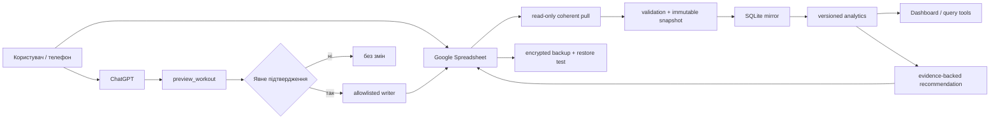

# Workout Tracker: архітектура Spreadsheet-first продукту

**Status:** implementation contract

**Updated:** 2026-07-24

**Primary product:** Google Spreadsheet

**Integration:** versioned ChatGPT plugin/MCP tools
**Analytics runtime:** Python 3.12+, Pydantic, SQLite

Цей документ є системним оглядом. Нормативні рішення розміщені в
[docs/architecture](docs/architecture/README.md), продуктові вимоги — у
[PRD](docs/prd/PRD-GOOGLE-SHEETS-WORKOUT-COACH.md), integration/workbook
контракти — у [docs/specs](docs/specs/SPEC-GOOGLE-SHEETS-WORKBOOK.md), а
машинозчитувані схеми й правила — у [config](config/schema.yaml).

## 1. Кінцева ціль

Workout Tracker забезпечує повний контрольований цикл:

```text
чотири комплекси в Google Spreadsheet
→ виконане тренування
→ ручний або ChatGPT capture
→ підтверджений атомарний запис
→ перевірена історія та метрики
→ evidence-backed recommendation
→ явне рішення користувача
```

Spreadsheet має залишатися якісним самостійним продуктом: план і ручне
внесення доступні навіть без ChatGPT або локального аналітичного контуру.

## 2. Scope першого milestone

### Входить

- repeatable setup семи вкладок, validation, protections, formulas і dashboard;
- bootstrap чотириденної Upper/Lower програми з repository specifications;
- ручний mobile-friendly capture;
- ChatGPT preview, clarification, confirmation та allowlisted write-back;
- stable IDs, idempotency й atomic session/set bundle semantics;
- read-only coherent snapshots та rebuildable SQLite mirror;
- versioned metrics, history queries і evidence reports;
- deterministic progression та окремі AI-generated recommendations;
- privacy controls, audit, backup і isolated restore verification.

### Не входить

- multi-user coaching platform;
- довільне редагування Sheet моделлю;
- автоматичне застосування program changes;
- wearable/background health ingestion;
- медичні діагнози, лікування або причинні health claims;
- server database як primary source of truth.

Повний scope визначає
[PRD](docs/prd/PRD-GOOGLE-SHEETS-WORKOUT-COACH.md).

## 3. Джерела правди

| Інформація | Власник | Інші представлення |
|---|---|---|
| Виконані сесії й підходи | Google Sheets | snapshots і rebuildable mirror |
| Operational program versions | Google Sheets `Програма` | bootstrap spec і validated projection |
| Recommendation history | Google Sheets `Рекомендації` | evidence projection |
| Schema, formulas, normalization | Git | generated workbook objects |
| Executable progression rules | Git | deterministic outcomes |
| Dashboard cells/charts | Ніхто як primary owner | derived from authoritative tabs |
| SQLite | Ніхто як primary owner | rebuildable analytical store |

Рядок, дата, назва вправи або content hash не є identity. Обов’язкові
source-owned `program_item_id`, `session_id`, `set_id` і `recommendation_id`.

Нормативне рішення:
[ADR-001](docs/architecture/ADR-001-authority-boundaries.md) та
[ADR-003](docs/architecture/ADR-003-spreadsheet-first-product.md).

## 4. System context



Read і write credentials розділені. Модель не бачить credentials, live Sheet
locator і не має arbitrary cell/range tool.

## 5. Workbook contract

Керовані вкладки:

- `Старт`;
- `Програма`;
- `Сесії`;
- `Підходи`;
- `Рекомендації`;
- `Довідники`;
- `Дашборд`.

Перші чотири domain tabs — `Програма`, `Сесії`, `Підходи`,
`Рекомендації` — є authoritative для operational records. Решта є
інтерфейсом, configuration projection або derived output.

Українські назви й labels є exact source values. English snake_case values є
internal aliases. Формули та protected/system columns не змішуються з
користувацьким вводом.

Повний контракт:
[SPEC-GOOGLE-SHEETS-WORKBOOK.md](docs/specs/SPEC-GOOGLE-SHEETS-WORKBOOK.md).

## 6. Program bootstrap

Workbook містить чотири комплекси:

| Source label | Internal code |
|---|---|
| `Верх — сила` | `upper_strength` |
| `Низ — сила` | `lower_strength` |
| `Верх — гіпертрофія` | `upper_hypertrophy` |
| `Низ — гіпертрофія` | `lower_hypertrophy` |

Bootstrap зберігає order/pair, exact variant, equipment/setup, sets, reps або
duration, RIR, rest і optional semantics. Уже використана program version є
immutable; зміна prescription створює нову `program_version_id`.

Repository program Markdown є bootstrap specification, а не паралельним
власником historical prescriptions.

## 7. ChatGPT capture and write safety

Стабільна межа інтеграції — versioned tool schemas:

- `preview_workout`;
- `commit_workout`;
- `query_training_history`;
- `analyze_progress`;
- `propose_recommendations`.

Write protocol:

```text
user-authored description
→ normalization without invented values
→ missing/ambiguity check
→ human-readable preview
→ explicit confirmation
→ contract/program preconditions
→ idempotent bounded batch write
→ committed bundle marker
→ redacted audit outcome
```

`commit_workout` приймає confirmation token, preview hash,
`idempotency_key` та expected contract/program versions. Retry не створює
дубль. Invalid або partial bundle не стає видимим readers.

Нормативний контракт:
[SPEC-CHATGPT-WORKOUT-CAPTURE.md](docs/specs/SPEC-CHATGPT-WORKOUT-CAPTURE.md).

## 8. Data model principles

### Identity and revision

Source-owned identity не змінюється при factual correction. Змінений payload
створює нову immutable revision під тим самим ID.

```text
source identity → immutable content revision → snapshot occurrence
```

### Logical sets

Set має logical header і один або кілька components, тому bilateral,
`each_side`, окремі `left`/`right`, duration і repetition sets не
спотворюються fake reps або дубльованими prescribed sets.

### Load and comparison

Зберігаються source value, unit, basis, loading kind, implement count, exact
variant, equipment і setup/comparison cohort. Machine display, free-weight
total, per-dumbbell load та assistance не змішуються.

Повний field/type/null/unit contract:
[DATA_MODEL.md](docs/architecture/DATA_MODEL.md) і
[schema.yaml](config/schema.yaml).

## 9. Read, snapshot and mirror protocol

Аналітичний контур працює незалежно від writer:

```text
exclusive lock
→ source version before
→ coherent four-domain-tab capture
→ source version after
→ immutable snapshot commit
→ validate and quarantine
→ deterministic normalize
→ stage and diff
→ atomic SQLite promotion
```

Гарантії:

- read-only credential для pull;
- invalid session/child-set bundle quarantine-иться разом;
- повторний logical input не змінює mirror;
- correction створює одну revision;
- coherent disappearance створює tombstone, не стираючи history;
- failure залишає попередній complete mirror активним.

Нормативний protocol:
[SYNC_PROTOCOL.md](docs/architecture/SYNC_PROTOCOL.md).

## 10. Metrics and dashboard

Warm-ups та invalid/aborted sets не рахуються як working volume. Missing або
incomparable input повертає status і `NULL`, не zero.

Порівняння дозволене лише в одному cohort за exact variant, equipment, setup,
load basis і assistance semantics. e1RM використовує pinned formula та
eligibility window. Recovery analysis є descriptive, не causal.

Кожна metric має formula version, parameters, input IDs, included/excluded
evidence та exclusion reasons. Sheet formulas, dashboard і local analytics
мають однакову семантику.

Нормативні формули:
[METRICS.md](docs/architecture/METRICS.md).

## 11. Progression and recommendations

Deterministic progression — pure result версійованого ruleset. AI
recommendation — окрема immutable сутність з evidence window, rationale,
limitations і status.

Недостатні або непорівнювані дані дають `insufficient_evidence`. Рекомендація
не змінює `Програма`; прийнята зміна потребує explicit owner approval і нової
program version.

Ruleset:
[progression-rules.yaml](config/progression-rules.yaml).

## 12. Privacy and medical boundary

- Secrets, live Sheet locator, exports, SQLite, reports, logs і backups не
  потрапляють у Git.
- Capture передає моделі лише user-authored content і мінімальні довідники,
  потрібні для поточного запиту.
- Analysis повертає мінімальні агрегати/evidence; bulk raw history і
  unrelated health context не передаються.
- Logs містять IDs, hashes, counts, versions та error codes, але не raw notes,
  symptoms, body mass або row payloads.
- Pain, soreness, sleep, stress, nausea, dizziness і performance не є
  діагнозами. Система не призначає лікування й не стверджує медичну причинність.

Повна policy:
[SECURITY_AND_BACKUP.md](docs/architecture/SECURITY_AND_BACKUP.md).

## 13. Backup and restore

Backup охоплює authoritative domain data, program versions, contract versions
і rebuildable analytical state. Archive має manifest, checksums і encrypted
copies у різних fault domains.

Restore запускається в isolated empty environment, перевіряє manifest,
перебудовує mirror та зіставляє canary counts/hashes. Неповний archive не
публікується як successful restore. Окрема restore-to-Sheets процедура
потребує preview та explicit owner authorization.

## 14. Technology boundaries

Згідно з
[ADR-002](docs/architecture/ADR-002-python-sqlite-v1.md):

- Python 3.12+;
- uv-style dependency management;
- Pydantic validation boundary;
- SQLite rebuildable analytical store;
- Decimal/scaled integers для authoritative numeric calculations;
- pytest-compatible automated verification.

Business logic не залежить від ChatGPT adapter, CLI framework або Google
client. Workbook setup, writer, source pull, normalization, storage, metrics і
recommendations мають окремі boundaries.

## 15. Delivery strategy

Delivery має йти vertical slices:

1. machine-readable workbook contract і test workbook;
2. якісний workbook із чотирма комплексами;
3. preview/confirm/idempotent ChatGPT capture;
4. coherent mirror та history queries;
5. dashboard, metrics і evidence reports;
6. recommendations, privacy audit та verified restore.

Точні фази та requirement traceability визначає
[.planning/ROADMAP.md](.planning/ROADMAP.md).

## 16. Definition of done

Перший milestone завершений лише коли:

- усі PRD requirements mapped рівно до однієї фази й verified;
- clean workbook setup і повторний setup проходять UAT без logical diff;
- чотири комплекси відповідають repository specifications;
- preview/confirm/commit, retry, timeout і partial-failure tests проходять;
- manual capture працює без ChatGPT;
- dashboard і local metrics збігаються на canonical fixtures;
- recommendation не змінює програму без explicit approval;
- repository privacy scan проходить;
- backup успішно відновлений у clean isolated environment;
- remote public-history disclosure отримав явне owner disposition.
