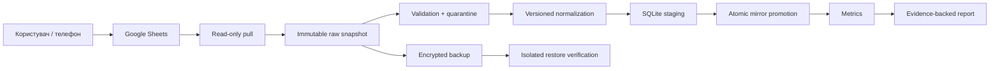

# Workout Tracker: архітектура v1

**Status:** implementation contract

**Updated:** 2026-07-24

**Runtime:** Python 3.12+ local CLI
**Current milestone:** read-only sync, analytics, evidence report and restore

Цей документ є оглядом системи. Нормативні деталі розміщені в
[docs/architecture](docs/architecture/ARCHITECTURE_REVIEW.md), машинозчитувані
контракти — у [config](config/schema.yaml), а scope і delivery order — у
[.planning](.planning/PROJECT.md).

## 1. Мета

Workout Tracker повинен однією повторюваною CLI-командою:

1. безпечно прочитати авторитетні дані з Google Sheets;
2. перевірити контракт і якість рядків;
3. створити immutable raw snapshot;
4. побудувати ідемпотентне SQLite-дзеркало;
5. обчислити версійовані метрики;
6. створити відтворюваний звіт із evidence lineage;
7. довести, що backup відновлюється.

Система не повинна вигадувати пропущені значення, змішувати непорівнювані
вправи або подавати медичний висновок як тренувальну аналітику.

## 2. Scope v1

### Входить

- exact schema validation чотирьох вкладок;
- read-only Google Sheets pull;
- immutable snapshots і quarantine evidence;
- deterministic normalization;
- SQLite current projection, history і tombstones;
- історія за workout type, exercise і date range;
- working-set, repetition, load, e1RM, RIR, rest і recovery metrics;
- one-command evidence report;
- repository privacy check;
- portable backup та isolated restore verification.

### Не входить

- workout capture у Google Sheets;
- будь-який write-back;
- generated progression або AI recommendations;
- автоматична зміна програми;
- Telegram, mobile, web, voice або wearable UI;
- multi-user, authentication і server database;
- медичні діагнози, лікування чи medication advice.

Повний scope: [.planning/REQUIREMENTS.md](.planning/REQUIREMENTS.md).

## 3. Джерела правди

Кожен клас інформації має одного власника.

| Інформація | Власник | Локальна роль |
|---|---|---|
| Виконані сесії та підходи | Google Sheets | Immutable snapshot і rebuildable mirror |
| Operational program versions | Google Sheets `Програма` | Validated versioned projection |
| Зовнішні recommendations | Google Sheets `Рекомендації` | Read-only history |
| Sheet schema і normalization | Git `config/schema.yaml` | Executable contract |
| Progression rules і formulas | Git `config/` та architecture specs | Versioned executable rules |
| Metrics і reports | Локальний код | Derived, reproducible artifacts |
| SQLite | Ніхто як primary owner | Rebuildable analytical store |

Подробиці й наслідки:
[ADR-001](docs/architecture/ADR-001-authority-boundaries.md).

## 4. System context



V1 не має стрілки назад у Google Sheets.

## 5. Google Sheets contract

Очікуються рівно чотири operational tabs:

- `Програма`;
- `Сесії`;
- `Підходи`;
- `Рекомендації`.

Українські labels є authoritative. English values на кшталт
`upper_strength` — лише internal aliases.

Дозволені workout types:

| Source label | Internal code |
|---|---|
| `Верх — сила` | `upper_strength` |
| `Низ — сила` | `lower_strength` |
| `Верх — гіпертрофія` | `upper_hypertrophy` |
| `Низ — гіпертрофія` | `lower_hypertrophy` |

Required stable identities:

- `program_item_id`;
- `session_id`;
- `set_id`;
- `recommendation_id`.

Row number, date, exercise name, set ordinal і content hash не можуть бути
identity. Existing rows without IDs require a one-time reviewed migration
while the Sheet is frozen.

Повний field/type/null/unit contract:
[DATA_MODEL.md](docs/architecture/DATA_MODEL.md) і
[schema.yaml](config/schema.yaml).

## 6. Data model principles

### Identity and revision

Source-owned identity не змінюється при factual correction. Змінений payload
створює нову immutable revision під тим самим ID.

```text
source identity → immutable content revision → snapshot occurrence
```

Кожна occurrence зберігає:

- `snapshot_id`;
- source tab і numeric sheet ID;
- diagnostic row locator;
- raw row hash;
- schema і normalizer versions;
- validation outcome.

### Program history

Кожна нова session має `program_version_id`. Уже використану program version
не редагують: створюють нову.

### Logical sets

Один set може бути:

- bilateral;
- однаковий `each_side`;
- окремий `left` і `right`;
- repetition-based;
- duration-based.

Тому set складається з logical header і одного або кількох components.
Bulgarian split squat для правої та лівої ноги залишається одним prescribed
set, а side plank зберігає seconds, не fake reps.

### Load

Unitless load заборонений. Потрібні:

- `load_value`;
- `load_unit`;
- `load_basis`;
- `loading_kind`;
- `implement_count`;
- exact exercise variant, equipment і setup/comparison cohort.

Machine display, free-weight total, per-dumbbell load і assistance не
змішуються.

## 7. Pull and reconciliation protocol

```text
exclusive lock
→ preflight
→ source version before
→ coherent four-tab capture
→ source version after
→ immutable snapshot commit
→ validate and quarantine
→ deterministic normalize
→ stage and diff
→ atomic SQLite promotion
→ manifest and audit summary
```

Ключові гарантії:

- credentials мають read-only scope;
- source version change під час capture скасовує attempt;
- partial capture ніколи не отримує `COMPLETE`;
- invalid session або child set quarantine-ить увесь session bundle;
- rejected authoritative entity за замовчуванням не дозволяє замінити active
  mirror;
- repeated identical snapshot не створює domain/history versions;
- correction під тим самим ID створює одну revision;
- coherent disappearance створює tombstone, але не стирає history;
- mirror tables і `current_snapshot_id` змінюються однією транзакцією;
- failure залишає попередній complete mirror активним.

Нормативний protocol:
[SYNC_PROTOCOL.md](docs/architecture/SYNC_PROTOCOL.md).

## 8. Local storage

```text
data/
├── raw/<snapshot_id>/       immutable source capture
├── processed/               rebuildable normalized exports
├── quarantine/              diagnostics, not active data
├── backups/                 encrypted portable archives
└── workout-tracker.sqlite   rebuildable analytical store
```

Raw snapshot завершується content hashes, manifest і `COMPLETE` marker.
Consumers не читають `.staging` або snapshot без valid manifest.

SQLite містить:

- current source projections;
- immutable source revision history;
- snapshot occurrences;
- quarantine diagnostics;
- metric results and evidence;
- sync run ledger;
- active mirror head.

Source facts і derived metrics перебувають у різних tables.

## 9. Metrics

`Volume` не є одним числом. V1 окремо визначає:

- completed working-set count;
- repetition volume;
- eligible load volume;
- primary muscle-group set volume.

Додатково:

- maximum load порівнюється лише в одному comparison cohort;
- e1RM використовує `epley-v1`, working sets і 1–12 reps;
- missing або ambiguous inputs дають `NULL` зі status/reason;
- timed, bodyweight, assistance й incomparable machine work не стають
  нульовим tonnage;
- RIR не вгадується;
- rest means `rest_after_set_seconds`, а `between_sides_seconds` зберігається
  окремо;
- recovery comparisons у v1 є descriptive, не causal.

Кожна metric зберігає formula version, canonical parameters, input IDs,
included/excluded evidence та exclusion reasons.

Нормативні формули:
[METRICS.md](docs/architecture/METRICS.md).

## 10. Reports and reproducibility

Report identity визначається:

- snapshot і per-tab hashes;
- code commit;
- source schema, normalizer, taxonomy, program і formula versions;
- canonical CLI parameters;
- timezone і deterministic ordering.

Generated timestamp і output path не входять до substantive hash.

Однакові inputs і versions мають давати однаковий substantive report hash.
Зміна одного set повинна змінити лише metrics, що посилаються на цей set у
dependency evidence.

## 11. Progression and recommendations

V1 не генерує progression output.

У майбутньому:

- deterministic standard step є pure versioned rule;
- одне session occurrence достатнє лише після повної перевірки prescribed
  sets, reps, RIR, technique, pain, program version, comparison cohort та
  configured increment;
- analytical program change потребує щонайменше трьох comparable session
  occurrences;
- trend evidence: менше 6 — insufficient, 6–7 — provisional, 8+ — normal;
- missing pain, technique або RIR не означає pass.

Ruleset:
[progression-rules.yaml](config/progression-rules.yaml).

## 12. Security and privacy

- Немає live Sheet locator у tracked config або docs.
- Tokens зберігаються в OS secure storage або viewer-only service-account
  credential file поза репозиторієм.
- Core v1 запитує тільки Sheets read-only access.
- Local data directories мають private permissions.
- Logs не містять tokens, notes, symptoms, body mass, Sheet locators або raw
  rows.
- Personal workout data не надсилаються до LLM або telemetry у v1.
- `.gitignore` виключає credentials, exports, SQLite, reports, logs, backups
  і local GSD attempts.

Security audit виявив operational metadata в уже опублікованій історії.
Current-file cleanup не стирає history; remote remediation потребує explicit
owner authorization.

Повна policy:
[SECURITY_AND_BACKUP.md](docs/architecture/SECURITY_AND_BACKUP.md).

## 13. Backup and restore

V1 policy:

- RPO не більше 24 hours;
- backup після кожного successful validated pull і щонайменше daily;
- 35 daily та 12 month-end verified backups;
- дві encrypted copies у різних fault domains;
- full isolated restore test щонайменше weekly.

Restore працює offline в empty directory, перевіряє manifest/checksums,
перебудовує новий SQLite, запускає foreign-key/integrity checks і canary
metric/report hash. Неповний або змінений archive завершується nonzero й не
публікує database як successful.

Restore-to-Google-Sheets не входить до v1.

## 14. Technology and repository layout

Stack decision:
[ADR-002](docs/architecture/ADR-002-python-sqlite-v1.md).

```text
workout-tracker/
├── .planning/
├── config/
│   ├── schema.yaml
│   ├── progression-rules.yaml
│   └── settings.example.yaml
├── docs/architecture/
├── src/
│   ├── source/
│   ├── sync/
│   ├── storage/
│   ├── analytics/
│   └── reporting/
├── data/             # ignored
├── reports/          # generated and ignored
├── tests/
├── .env.example
├── .gitignore
├── AGENTS.md
└── README.md
```

`src/`, `data/`, `reports/` і `tests/` створюються під час execution phases,
а не як порожня architecture scaffold.

## 15. Observability and failures

Кожен run має:

- `run_id` і `snapshot_id`;
- stage durations;
- retry counts;
- per-tab fetched/accepted/rejected/inserted/updated/unchanged/tombstoned
  counts;
- stable error codes;
- machine-readable manifest;
- redacted human summary.

Suggested exit categories:

| Code | Category |
|---:|---|
| 0 | success/no-op/warnings |
| 10–12 | auth, remote or unstable source |
| 20–21 | schema/identity or quarantined data |
| 30–31 | lock, I/O, checksum or SQLite |
| 40 | future write precondition conflict |
| 70 | internal invariant violation |

Manifest outcome є authoritative; exit code потрібен для automation.

## 16. Delivery roadmap

1. Довірений контракт даних.
2. Ідемпотентне локальне дзеркало.
3. Історія та базова аналітика.
4. Відтворюваний звіт із доказами.
5. Приватність і перевірене відновлення.

Критерії та traceability:
[.planning/ROADMAP.md](.planning/ROADMAP.md).

## 17. Definition of done for v1

V1 готовий лише коли:

- 22/22 requirements verified;
- source migration забезпечила всі stable IDs;
- repeat pull і row reorder не створюють logical changes;
- correction, tombstone, quarantine і injected-failure tests проходять;
- metric eligibility/exclusion cases покриті fixtures;
- identical inputs дають identical substantive report hash;
- repository safety scan проходить;
- backup успішно відновлений у clean offline location;
- remote public-history disclosure отримав явне owner disposition.
