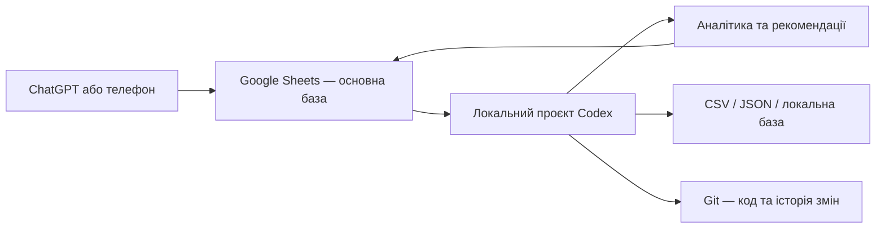

# Workout Tracker: архітектура та план розвитку

## 1. Мета проєкту

Створити персональну систему трекінгу тренувань, яка:

- дозволяє швидко записувати тренування через ChatGPT або з телефона;
- зберігає програму, тренувальні сесії та кожен окремий підхід;
- показує прогрес за обсягом, робочою вагою, відпочинком і самопочуттям;
- накопичує структуровані дані для подальшої аналітики;
- допомагає приймати рішення щодо ваги, повторів, підходів, відновлення та зміни програми;
- не прив'язує дані назавжди до одного сервісу;
- у майбутньому може стати основою мобільного застосунку або персонального AI-тренера.

## 2. Основне архітектурне рішення

Проєкт використовуватиме гібридну архітектуру:

- **Google Sheets** — головне місце з актуальними тренувальними даними та простий мобільний інтерфейс.
- **Локальний Codex-проєкт** — код синхронізації, аналітика, правила рекомендацій, документація і тести.
- **Git** — історія змін коду, конфігурації, документації та логіки аналізу.
- **CSV, JSON або локальна база даних** — переносні локальні представлення даних для обробки та резервування.



## 3. Джерело правди

Google Sheets залишається **єдиним джерелом правди для тренувальних даних**.

Це означає:

- нові тренування спочатку записуються в Google Sheets;
- виправлення фактичних даних виконуються в Google Sheets;
- локальні CSV, JSON і база даних є копіями для аналізу, а не незалежними версіями тих самих записів;
- локальний код може записувати назад рекомендації та розраховані результати, але не повинен непомітно перезаписувати первинні дані;
- кожна синхронізація повинна бути повторюваною та не створювати дублікати.

Такий підхід зменшує ризик конфліктів між локальною та онлайн-версіями.

## 4. Google Sheets

Поточна таблиця:

[Мій трекер тренувань](https://docs.google.com/spreadsheets/d/15TqKmdooX0XFsNi-Qh7LmFUK_E-i2x_U47OgJNn3Xn0/edit)

### Роль Google Sheets

Google Sheets використовується для:

- внесення тренувань через ChatGPT;
- ручного введення або виправлення даних з телефона чи комп'ютера;
- швидкого перегляду попередніх тренувань;
- фільтрації за типом тренування та вправою;
- базових формул і графіків;
- зберігання рекомендацій та історії прийнятих рішень;
- експорту даних в Excel, CSV та інші формати.

### Основні вкладки

#### `Старт`

Коротка інструкція та приклад повідомлення для запису тренування через ChatGPT.

#### `Програма`

Опис чотирьох повторюваних тренувань:

- Верх — сила;
- Низ — сила;
- Верх — гіпертрофія;
- Низ — гіпертрофія.

Для кожної вправи зберігаються цільові підходи, діапазон повторів, RIR, відпочинок, крок збільшення ваги, пріоритет і технічні нотатки.

#### `Сесії`

Один рядок відповідає одному завершеному тренуванню.

Сесія містить:

- унікальний ID;
- дату і тип тренування;
- тривалість;
- масу тіла;
- сон;
- енергію;
- стрес;
- крепатуру;
- суб'єктивну результативність;
- автоматичні підсумки робочих підходів;
- нотатки і прапорці ризику.

#### `Підходи`

Один рядок відповідає одному підходу.

Запис містить:

- ID сесії;
- дату і тип тренування;
- вправу та групу м'язів;
- номер і тип підходу;
- вагу;
- повтори;
- RIR;
- відпочинок;
- обсяг;
- орієнтовний e1RM;
- біль;
- оцінку техніки;
- нотатки.

Зв'язок через `ID сесії` дозволяє агрегувати будь-яке тренування, вправу або період.

#### `Прогрес`

Містить основні показники і графіки:

- кількість сесій;
- середній обсяг;
- максимальну робочу вагу;
- середній відпочинок;
- середню результативність;
- тенденції самопочуття і відновлення.

#### `Рекомендації`

Журнал рішень, сформованих людиною або LLM.

Для кожної рекомендації зберігаються:

- дата аналізу;
- сфера аналізу;
- вправа або тип тренування;
- виявлений сигнал;
- докази з даних;
- рекомендація;
- впевненість;
- дата повторної перевірки.

Це робить роботу AI-тренера прозорою та перевірюваною.

## 5. Чому не потрібно зберігати Google Sheet безпосередньо в Git

Google Drive for Desktop показує нативні Google-таблиці локально як файли `.gsheet`. Такий файл є переважно посиланням на онлайн-документ, а не повною локальною копією його даних.

Через це:

- `.gsheet` не підходить для нормального порівняння змін у Git;
- він не є надійною резервною копією;
- його не слід використовувати як вхідний файл для локальної аналітики;
- зміни формул, клітинок і графіків не відображаються у Git як зрозумілий diff.

Git має зберігати код і декларативні правила, а тренувальні дані потрібно отримувати через Google Sheets API або контрольований експорт.

## 6. Рекомендована структура локального проєкту

```text
workout-tracker/
├── README.md
├── WORKOUT_TRACKER_ARCHITECTURE.md
├── config/
│   ├── program.yaml
│   ├── progression-rules.yaml
│   └── settings.example.yaml
├── src/
│   ├── sync/
│   │   ├── pull-from-sheets.*
│   │   ├── push-recommendations.*
│   │   └── validate-sync.*
│   ├── analytics/
│   │   ├── session-metrics.*
│   │   ├── exercise-progress.*
│   │   ├── fatigue-signals.*
│   │   └── weekly-volume.*
│   └── recommendations/
│       ├── progression-engine.*
│       ├── evidence-builder.*
│       └── recommendation-log.*
├── data/
│   ├── raw/
│   ├── processed/
│   └── backups/
├── reports/
├── tests/
├── scripts/
├── .env.example
├── .gitignore
└── LICENSE
```

Розширення файлів у `src/` буде вибране після рішення щодо мови реалізації. Для цього проєкту однаково придатні Python і TypeScript. Python зручніший для статистики й аналізу даних; TypeScript може бути зручнішим, якщо майбутній інтерфейс буде вебзастосунком.

## 7. Що зберігати в Git

У Git потрібно зберігати:

- код синхронізації;
- код аналітики;
- правила прогресії;
- схему таблиць і локальної бази;
- конфігураційні шаблони;
- документацію;
- тести;
- шаблони звітів;
- анонімізовані або синтетичні приклади даних.

У Git не потрібно зберігати:

- ключі доступу до Google API;
- OAuth-токени;
- файли `.env` із секретами;
- особисті дані в публічному репозиторії;
- автоматично створені кеші;
- кожен проміжний CSV-експорт;
- великі резервні копії, якщо для них немає окремої політики зберігання.

Навіть приватний репозиторій не повинен містити секрети доступу.

## 8. Синхронізація

### Основний напрямок

```text
Google Sheets → локальні дані → аналітика → рекомендації → Google Sheets
```

### Отримання даних

Локальний проєкт повинен уміти:

1. Прочитати вкладки `Програма`, `Сесії`, `Підходи` і `Рекомендації`.
2. Перевірити заголовки та типи даних.
3. Зберегти незмінну копію отриманих даних у `data/raw/`.
4. Нормалізувати дати, числа, назви вправ та ID.
5. Побудувати оброблені набори даних у `data/processed/`.
6. Не створювати дублікати при повторному запуску.

### Запис результатів назад

На першому етапі локальний код повинен записувати назад лише:

- нові рядки у `Рекомендації`;
- заздалегідь визначені розраховані поля;
- технічний статус останньої синхронізації, якщо буде створена відповідна вкладка.

Первинні записи тренувань не повинні автоматично масово перезаписуватися без явного підтвердження.

### Ідентифікатори та захист від дублікатів

Кожна сесія повинна мати стабільний `ID сесії`. Усі підходи цієї сесії використовують той самий ID.

Під час синхронізації потрібно:

- перевіряти, чи вже існує ID;
- оновлювати лише дозволені поля;
- вести журнал синхронізації;
- не покладатися лише на номер рядка, оскільки рядки можуть сортуватися або переміщуватися.

## 9. Локальні формати даних

### CSV

Підходить для:

- швидкого експорту;
- аналізу в Python або R;
- перенесення між системами;
- завантаження у бази даних.

Один CSV відповідає одній вкладці. CSV не зберігає формули, графіки, форматування або зв'язки між файлами.

### JSON

Підходить для:

- API;
- мобільного застосунку;
- вкладених структур;
- обміну даними з LLM;
- збереження результатів аналізу разом із метаданими.

### Excel `.xlsx`

Підходить для:

- повної ручної резервної копії;
- збереження формул, вкладок, форматування і графіків;
- відкриття таблиці без доступу до Google.

### SQLite

Може бути доданий пізніше як локальна аналітична база. Він зручний, коли CSV стає недостатньо, але окремий сервер бази даних ще не потрібний.

### PostgreSQL або Supabase

Доцільні після появи мобільного або вебзастосунку, кількох користувачів, авторизації чи складнішого API.

## 10. Щоденний робочий процес

### Після тренування

Користувач надсилає ChatGPT повідомлення приблизно такого формату:

> Запиши тренування в мій трекер. Дата: 2026-07-22. Тип: Верх — гіпертрофія. Тривалість: 72 хв. Сон: 7.5 год, енергія 4/5, стрес 2/5, крепатура 2/5, результативність 4/5. Жим гантелей: 30×10 RIR2, 30×10 RIR2, 30×9 RIR1, відпочинок 120 с. Болі немає.

ChatGPT повинен:

1. Перевірити, що тип тренування відповідає одному з чотирьох дозволених значень.
2. Сформувати унікальний ID сесії.
3. Додати один рядок у `Сесії`.
4. Додати окремий рядок для кожного підходу у `Підходи`.
5. Не вигадувати відсутні значення.
6. Позначити невідомі дані як порожні або попросити уточнення, якщо вони критичні.
7. Підтвердити, що було записано.

### Перед наступним тренуванням

Можна попросити:

> Покажи останнє тренування «Верх — гіпертрофія» і скажи, які ваги та повтори були в кожній вправі.

Пізніше система також зможе формувати короткий план наступної сесії на основі програми та останніх результатів.

### Періодичний аналіз

Після накопичення даних можна запитувати:

- аналіз прогресу конкретної вправи;
- порівняння останніх 4–8 тренувань;
- оцінку обсягу по групах м'язів;
- пошук стагнації;
- оцінку зв'язку між сном, стресом і результативністю;
- рекомендацію щодо збільшення ваги;
- рекомендацію щодо додаткового підходу;
- перевірку ознак поганого відновлення;
- оцінку доцільності заміни вправи або зміни програми.

## 11. Принципи рекомендацій

Система не повинна давати рекомендацію лише на основі однієї невдалої або успішної сесії.

Початкові орієнтири:

- щонайменше 3 виконання вправи для локального рішення щодо прогресії;
- приблизно 6–8 повторень типу тренування для оцінки тенденції;
- збільшення ваги розглядається, якщо верх цільового діапазону повторів виконується стабільно при цільовому RIR;
- техніка повинна залишатися стабільною;
- біль не повинен зростати;
- додатковий підхід розглядається лише тоді, коли відновлення стабільне, а поточний обсяг переноситься добре;
- падіння результативності потрібно оцінювати разом зі сном, стресом, крепатурою, RIR і болем;
- кожна рекомендація повинна посилатися на конкретні дані;
- кожна суттєва рекомендація повинна записуватися в журнал `Рекомендації`.

Прапорці системи не є медичним діагнозом. Гострий, сильний або стійкий біль потребує оцінки кваліфікованого медичного фахівця.

## 12. Резервне копіювання

Рекомендована політика:

- регулярний автоматичний експорт основних вкладок у CSV або JSON;
- періодична повна резервна копія в `.xlsx`;
- часові мітки у назвах резервних копій;
- перевірка можливості відновлення, а не лише факту створення файлу;
- зберігання резервних копій окремо від робочого кешу;
- виключення резервних копій із Git, якщо вони містять особисті дані.

## 13. Етапи розвитку

### Етап 1. Заповнення програми

- внести фактичні вправи для чотирьох тренувань;
- визначити підходи, діапазони повторів, RIR і відпочинок;
- узгодити кроки збільшення ваги;
- стандартизувати назви вправ.

### Етап 2. Накопичення якісних даних

- регулярно записувати тренування;
- завжди фіксувати вагу, повтори та RIR;
- за можливості фіксувати відпочинок;
- записувати сон, енергію, стрес, крепатуру і біль;
- виправляти помилки введення до проведення аналізу.

### Етап 3. Створення локального Git-проєкту

- створити директорію проєкту;
- ініціалізувати Git;
- додати цей документ і `README.md`;
- створити `.gitignore` та `.env.example`;
- вибрати Python або TypeScript;
- додати базову конфігурацію і тести.

### Етап 4. Синхронізація Google Sheets → локальні дані

- налаштувати авторизацію;
- реалізувати читання вкладок;
- додати перевірку схеми;
- реалізувати ідемпотентний імпорт;
- створити журнал синхронізації;
- додати автоматичні резервні копії.

### Етап 5. Базова аналітика

- прогрес ваги, повторів та e1RM;
- обсяг по сесіях, вправах і групах м'язів;
- середній RIR і відпочинок;
- тенденції самопочуття;
- виявлення пропущених або некоректних даних.

### Етап 6. Рушій рекомендацій

- формалізувати правила прогресії;
- відокремити фактичні метрики від рекомендацій;
- додати рівень впевненості;
- зберігати докази для кожного рішення;
- записувати рекомендації назад у Google Sheets;
- перевіряти результат рекомендації після наступних сесій.

### Етап 7. Розширений AI-тренер

- аналіз довгострокових тенденцій;
- персоналізація правил прогресії;
- прогнозування наступної робочої ваги;
- раннє виявлення плато;
- виявлення накопиченої втоми;
- пропозиції щодо заміни вправ;
- автоматична підготовка плану наступного тренування;
- пояснення кожної рекомендації зрозумілою мовою.

### Етап 8. Окремий інтерфейс

За потреби:

- Telegram-бот;
- мобільний застосунок;
- вебінтерфейс;
- голосове введення;
- інтеграція з wearable-пристроями;
- перенесення основної бази в PostgreSQL або Supabase.

Google Sheets на цьому етапі може залишитися зручним адміністративним інтерфейсом або резервним каналом доступу.

## 14. Найближчі практичні кроки

1. Створити локальну директорію `workout-tracker`.
2. Скопіювати цей документ у корінь нового проєкту.
3. Ініціалізувати приватний Git-репозиторій.
4. Додати фактичну програму чотирьох тренувань у Google Sheets.
5. Записати перші тренування через ChatGPT.
6. Вибрати Python або TypeScript для локальної реалізації.
7. Створити першу команду синхронізації Google Sheets → локальний CSV/JSON.
8. Додати перевірку схеми та захист від дублікатів.
9. Після накопичення даних реалізувати перший звіт прогресу.
10. Лише після перевірки базових метрик додавати автоматичні рекомендації.

## 15. Критерії успіху першої версії

Перша локальна версія вважається готовою, коли:

- усі тренування з Google Sheets стабільно завантажуються локально;
- повторний запуск не створює дублікатів;
- структура даних автоматично перевіряється;
- можна отримати історію конкретного типу тренування або вправи;
- можна розрахувати обсяг, максимальну вагу, e1RM, RIR і відпочинок;
- можна створити локальний звіт без ручного копіювання даних;
- секрети не потрапляють у Git;
- існує перевірена резервна копія;
- система пояснює, з яких даних отримано кожен висновок.

## 16. Підсумок

Google Sheets забезпечує просте щоденне введення і мобільний доступ. Локальний Codex-проєкт дає необмежені можливості для аналітики, автоматизації та розвитку AI-тренера. Git зберігає історію коду і правил, але не використовується як основне сховище живих тренувальних даних.

Основний принцип проєкту:

> Google Sheets зберігає факти, локальний код аналізує їх, а кожна рекомендація повинна мати зрозуміле обґрунтування.
